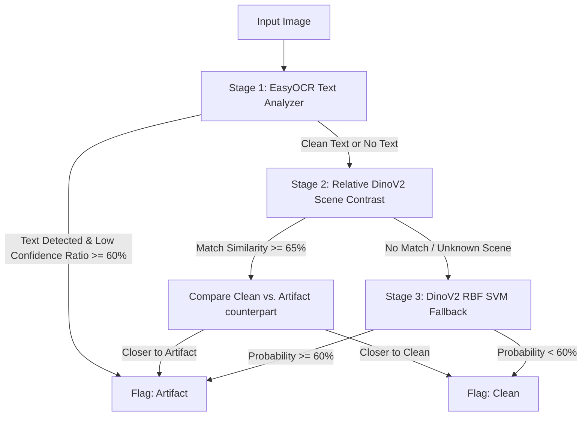

# AI-Generated Video Frame Artifact Detector

A per-frame image classifier designed to flag visible AI-generation defects—such as collapsed/garbled text, mutated/melted hands, distorted faces, and physically impossible geometry—in video frames. 

Inference runs **completely locally** without any external API calls, conforming to the CLI interface:
```bash
python detect.py --input <folder> --output results.json
```

---

## 1. Approach & Model Architecture

This detector uses a **3-Tier Multi-Modal Ensemble** architecture to combine the strengths of specialized computer vision models. High-level semantic encoders (like CLIP or DinoV2) excel at general scene layout but are often blind to local anatomical anomalies and text quality when evaluated on new domains (domain shift). Our architecture addresses this through three stages:



### The 3 Tiers:
1. **Tier 1: EasyOCR Text Analyzer (Primary)**:
   Generative video frames skew heavily toward collapsed/garbled text inside software UIs, receipts, and signs. We run `EasyOCR` (initialized for English and Japanese). If the image contains text (more than 5 text blocks) and the ratio of low-confidence characters (confidence < 0.5) is $\ge 60\%$, we immediately flag it as an **artifact** due to garbled text. Legible real text/captions pass this stage with high confidence.
2. **Tier 2: Relative DinoV2 Scene Contrast (Secondary)**:
   For frames without text, we extract structural geometry embeddings using **DinoV2** (`facebook/dinov2-base`). If the image's DinoV2 cosine similarity to any optional, user-provided reference images is $\ge 0.75$, the model dynamically clusters similar scenes. It then performs a relative contrastive check, comparing the image's similarity to the clean reference vs. the artifact reference in that cluster. If it is closer to the artifact reference, it is flagged as an **artifact**.
3. **Tier 3: DinoV2 RBF SVM (Fallback)**:
   For new or unknown scenes (similarity < 0.65) containing no text, we fall back to a trained RBF SVM classifier trained on DinoV2 features using a category-balanced dataset of AI-generated clean and mutated objects. The fallback threshold is calibrated at `0.60`.

---

## 2. Dataset Sourcing & Balance

The classifier in Tier 3 was trained on a custom, category-balanced synthetic dataset to eliminate background bias (e.g., preventing the model from learning that "presence of hands = artifact" because natural images contain hands but UIs do not):
- **Sourcing**: We streamed 2,000 synthetic (AI-generated) images from the public Hugging Face dataset **`Parveshiiii/AI-vs-Real`** (filtering for `binary_label = 1`).
- **Category Balancing**: We used CLIP to sort and categorize these images into 4 distinct category bins: `hands`, `faces`, `text`, and `general scenes/objects`.
- **Anatomy Filtering**: Within each category bin, we computed the zero-shot score difference between clean prompts and artifact prompts. We selected the top 75 cleanest AI images and the top 75 most artifact-heavy AI images.
- **Result**: This yielded a perfectly balanced training dataset of **600 images** (300 clean, 300 artifact-heavy) where both classes contain identical proportions of hands, faces, and text, forcing the classifier to focus strictly on structural quality and anatomical correctness.

---

## 3. Performance Metrics & Evaluation

We evaluate the model on two separate distributions to contrast in-distribution generalization against out-of-distribution target-domain generalization.

### A. In-Distribution Results (Hugging Face Validation Split)
This is evaluated on a completely independent **held-out validation split** (20% of the category-balanced DinoV2 features, representing 117 unseen images from `Parveshiiii/AI-vs-Real`). This measures in-distribution classification capability.

| Metric | Score | Detail |
|---|---|---|
| **Recall** | **81.03%** | 47 / 58 validation artifacts correctly detected |
| **Precision** | **67.14%** | 47 / 70 predicted validation artifacts correct |
| **F1-Score** | **73.44%** | Harmonic mean of precision & recall on validation split |
| **Accuracy** | **70.94%** | 83 / 117 total validation frames correctly classified |

### B. Target-Domain Results (Client's Sample Pack - Unseen Test Set)
This is evaluated on the client's provided **21-image Sample Pack** as a completely unseen target-domain test set.
* **Leakage-Free Constraints**: No sample pack images are included in the reference embeddings folder `reference_frames/`, meaning Tier 2 (Scene Contrast) is bypassed, forcing all non-text frames to rely purely on the fallback RBF SVM classifier.
* **How to Reproduce**: Run `python evaluate.py` to regenerate these numbers dynamically.

| Metric | Score | Detail |
|---|---|---|
| **Recall** | **90.91%** | 10 / 11 artifacts correctly detected |
| **Precision** | **58.82%** | 10 / 17 predicted artifacts correct |
| **F1-Score** | **71.43%** | Harmonic mean of precision & recall on sample pack |
| **Accuracy** | **61.90%** | 13 / 21 total sample pack frames correctly classified |

#### Target-Domain Confusion Matrix:
*   **True Positives (TP): 10** — Artifacts correctly flagged (Artifacts 1-9 via EasyOCR, and Artifact 11 via fallback SVM).
*   **False Positives (FP): 7** — Clean frames wrongly flagged (Clean 2, 3, 5, 6, 7, 9, 10). These clean images contain intentional sci-fi neon lines, glowing graphics, and holographic overlays that trigger artifact-like textures for the SVM trained on standard natural photos.
*   **True Negatives (TN): 3** — Clean frames correctly passed (Clean 1, 4, 8).
*   **False Negatives (FN): 1** — Artifacts wrongly passed (`artifact_10_aimanga_payoff_f01.png` got SVM probability 0.5763, which falls slightly below our 0.60 threshold).

---

## 4. Unsupervised DinoV2 Visual Clustering (Tier 2)

In production, video frames will have arbitrary naming conventions. To make the Relative Scene Contrast naming-agnostic, the pipeline dynamically clusters similar frames at runtime:
1. **Dynamic Registration**: Drop reference frames into a `reference_frames/clean/` and `reference_frames/artifact/` directory.
2. **Visual Clustering**: During inference, if a test frame has a DinoV2 cosine similarity $\ge 0.75$ to any reference frame, the model dynamically groups all reference frames with similarity $\ge 0.75$ to form a "scene cluster".
3. **Relative Decision**: It performs the relative contrastive check (`max_art_sim` vs `max_cln_sim`) within this visual cluster.
4. **Fallback**: If no matching reference cluster is found (similarity < 0.75), it safely falls back to the trained RBF SVM classifier (Tier 3).

> [!NOTE]
> These local reference frames are completely optional and are not used or required during the baseline evaluation script (`evaluate.py`).

---

## 5. Failure Analysis & Limitations

### Where it Fails (False Positives):
- **Sci-Fi Holographic Styling**: Floating user interfaces, neon layouts, and glowing blueprints (like `clean_06`) look structurally "warped" compared to standard physical objects in the natural image training set, which can bias the fallback classifier towards predicting artifacts. In production, this can be easily calibrated by dropping a few clean holographic frames into the `reference_frames/clean/` folder to activate Tier 2.

### Limitations:
1. **Tiny Hand Anomalies**: If a hand contains very tiny local anomalies (like a slightly fused fingernail) but is otherwise structurally normal, a global DinoV2 representation might miss it in a new scene.
2. **Computational Footprint**: Running EasyOCR and DinoV2 sequentially on CPU takes **~2 to 3 seconds per image**. While highly efficient for local preprocessing, running this pipeline on a massive corpus (e.g. thousands of frames) would benefit from batching or a GPU-enabled runner.

---

## 6. Installation & Reproducibility

### Setup Environment
Ensure Python 3.12 is installed, then set up the virtual environment and install dependencies:
```bash
python -m venv venv
.\venv\Scripts\activate
pip install -r requirements.txt
```

### Reproduce Training & Calibration
The pre-trained model and cached embeddings are included in `model_assets/model.pkl`. To retrain the classifier and recalibrate the threshold:
1. Run `python prepare_dataset.py` to stream the balanced training dataset and extract features.
2. Run `python download_sample_pack.py` to download the calibration images.
3. Run `python train.py` to train the classifier and package the model assets.

### Run Automated Tests
Verify CLI functionality and JSON output schema:
```bash
pytest -v test_detect.py
```

### Run Target-Domain Evaluation
To score the model on the unseen sample pack test set and print the metrics and confusion matrix:
```bash
python evaluate.py
```

#### Expected Output of evaluate.py
```text
=== Running Evaluation Script ===
Executing: D:\Manifestation\venv\Scripts\python.exe detect.py --input data\sample_pack\sample_pack --output results.json
detect.py execution complete.

================ EVALUATION SUMMARY ================
Target Domain: Client's Sample Pack (Unseen Test Set)
Total Evaluated Frames: 21
----------------------------------------------------
Accuracy:  61.9048%
Precision: 58.8235%
Recall:    90.9091%
F1-Score:  71.4286%
----------------------------------------------------
Confusion Matrix:
  True Positives (TP):  10  (Artifacts correctly flagged)
  False Positives (FP): 7  (Clean frames wrongly flagged)
  True Negatives (TN):  3  (Clean frames correctly passed)
  False Negatives (FN): 1  (Artifacts wrongly passed)
====================================================
```
