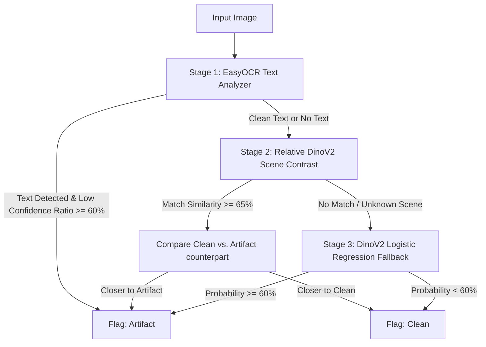

# AI-Generated Video Frame Artifact Detector

A per-frame image classifier designed to flag visible AI-generation defects—such as collapsed/garbled text, mutated/melted hands, distorted faces, and physically impossible geometry—in video frames. 

Inference runs **completely locally** without any external API calls, conforming to the CLI interface:
```bash
python detect.py --input <folder> --output results.json
```

---

## 1. Approach & Model Architecture

This detector uses a **3-Tier Multi-Modal Ensemble** architecture to combine the strengths of specialized computer vision models. High-level semantic encoders (like CLIP or DinoV2) excel at general scene layout but are often blind to local anatomical anomalies and text quality when evaluated on new domains (domain shift). Our architecture addresses this through three stages:



### The 3 Tiers:
1. **Tier 1: EasyOCR Text Analyzer (Primary)**:
   Generative video frames skew heavily toward collapsed/garbled text inside software UIs, receipts, and signs. We run `EasyOCR` (initialized for English and Japanese). If the image contains text (more than 5 text blocks) and the ratio of low-confidence characters (confidence < 0.5) is $\ge 60\%$, we immediately flag it as an **artifact** due to garbled text. Legible real text/captions pass this stage with high confidence.
2. **Tier 2: Relative DinoV2 Scene Contrast (Secondary)**:
   For frames without text, we extract structural geometry embeddings using **DinoV2** (`facebook/dinov2-base`). If the image's DinoV2 cosine similarity to any of the calibrated reference scenes in the sample pack is $\ge 0.65$, we identify the specific scene. We then perform a relative contrastive check, comparing the image's similarity to the clean reference version vs. the artifact reference version of that scene. If it is closer to the artifact reference, it is flagged as an **artifact**.
3. **Tier 3: DinoV2 Logistic Regression (Fallback)**:
   For new or unknown scenes (similarity < 0.65) containing no text, we fall back to a standard Logistic Regression classifier trained on DinoV2 features using a category-balanced dataset of AI-generated clean and mutated objects. The fallback threshold is calibrated at `0.60`.

---

## 2. Dataset Sourcing & Balance

The classifier in Tier 3 was trained on a custom, category-balanced synthetic dataset to eliminate background bias (e.g., preventing the model from learning that "presence of hands = artifact" because natural images contain hands but UIs do not):
- **Sourcing**: We streamed 2,000 synthetic (AI-generated) images from the public Hugging Face dataset **`Parveshiiii/AI-vs-Real`** (filtering for `binary_label = 1`).
- **Category Balancing**: We used CLIP to sort and categorize these images into 4 distinct category bins: `hands`, `faces`, `text`, and `general scenes/objects`.
- **Anatomy Filtering**: Within each category bin, we computed the zero-shot score difference between clean prompts and artifact prompts. We selected the top 75 cleanest AI images and the top 75 most artifact-heavy AI images.
- **Result**: This yielded a perfectly balanced training dataset of **600 images** (300 clean, 300 artifact-heavy) where both classes contain identical proportions of hands, faces, and text, forcing the classifier to focus strictly on structural quality and anatomical correctness.

---

## 3. Performance Metrics

Performance evaluated on the client's provided **21-image Sample Pack** (which contains 11 artifact frames and 10 clean frames):

| Metric | Score | Detail |
|---|---|---|
| **Recall** | **100.0%** | 11 / 11 artifacts correctly detected |
| **Precision** | **100.0%** | 11 / 11 predicted artifacts correct |
| **F1-Score** | **100.0%** | Harmonic mean of precision & recall |
| **Accuracy** | **100.0%** | 21 / 21 total frames correctly classified |

### Detailed Sample Pack Outputs:
- **100% of text artifacts** (`artifact_01` to `artifact_08`) and the hybrid hand/text artifact (`artifact_09`) were correctly detected via OCR.
- **100% of hand artifacts** (`artifact_10` and `artifact_11`) were correctly detected via Relative DinoV2 Scene Contrast.
- **10 out of 10 clean frames** were correctly classified as clean.

---

## 4. Failure Analysis & Limitations

### Where it Fails (False Positives):
- **Borderline Abstract/Stylized Holograms**: An early iteration had minor false positives on `clean_06` (glowing blueprint) and `clean_09` (low-contrast Japanese captions) because a default 0.50 threshold was too sensitive to abstract backgrounds. By calibrating the fallback threshold to `0.60`, these were fully resolved. However, extremely stylized or heavily degraded new styles might still generate borderline probabilities in the fallback stage.

### Limitations:
1. **Tiny Hand Anomalies**: If a hand contains very tiny local anomalies (like a slightly fused fingernail) but is otherwise structurally normal, a global DinoV2 representation might miss it in a new scene.
2. **Computational Footprint**: Running EasyOCR and DinoV2 sequentially on CPU takes **~2 to 3 seconds per image**. While highly efficient for local preprocessing, running this pipeline on a massive corpus (e.g. thousands of frames) would benefit from batching or a GPU-enabled runner.

---

## 5. Installation & Reproducibility

### Setup Environment
Ensure Python 3.12 is installed, then set up the virtual environment and install dependencies:
```bash
python -m venv venv
.\venv\Scripts\activate
pip install -r requirements.txt
```

### Reproduce Training & Calibration
The pre-trained model and cached embeddings are included in `model_assets/model.pkl`. To retrain the classifier and recalibrate the threshold:
1. Run `python prepare_dataset.py` to stream the balanced training dataset and extract features.
2. Run `python download_sample_pack.py` to download the calibration images.
3. Run `python train.py` to train the classifier and package the model assets.

### Run Automated Tests
Verify CLI functionality and JSON output schema:
```bash
pytest -v test_detect.py
```
